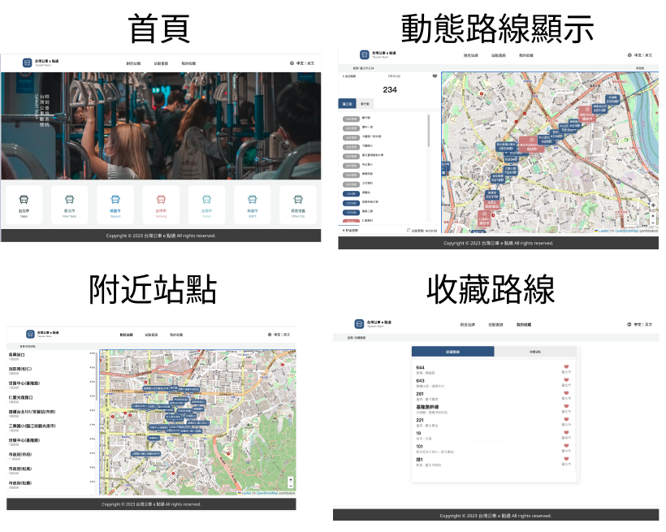

# f2e-time-twbus

- 作品畫面
  -   web版 (1440px)

  - phone 版（375px）

----


## 作品說明
The F2E 全台公車動態時刻查詢應用服務。
- 設計稿特別感謝 [設計師 鹽酥G](https://2021.thef2e.com/users/6296432819610583727/) 提供。
- 後端資料來自 [TDX 運輸資料流通服務](https://tdx.transportdata.tw/api-service/swagger)
- 網頁網址 [https://minilabmemo.github.io/f2e-time-twbus/](https://minilabmemo.github.io/f2e-time-twbus/)

### 功能說明
目前僅提供網頁版面。
- 附近站點
- 站點查詢 -> 動態路線顯示：提供站點動態更新到站時間。
  - 目前因為後端資料不足，僅提供只支援台北/台南/新北/桃園/台中地區。
- 我的收藏

## 系統說明
本專案使用 `create-react-app` typescript 範本，部署到 Github Pages， 
- Node.js `v20.9.0`
- 環境變數請參考 [env_template](./env_template)
- 指令
  - `npm install` 下載依賴包
  - `npm start` 運行
  - `npm test` 運行測試

### 運行測試
```
npm test
npm test -- --coverage 
coverage/lcov-report/src/components/index.html
```

### 進度 Todo Tree
｀｀｀
TODO 待進行
NEEDCHECK 需確認事項
FIXME 有問題待修正
｀｀｀

#### 資料夾說明
```
src .
├── __snapshots__
├── components //共用元件
│   ├── Icons
│   ├── base
│   ├── btn
│   └── files
├── layouts
│   ├── pages //分頁
├── apis
├── images //圖片
├── stories //storybook資料
│   └── assets
├── styles //scss相關檔案
│   └── partials
│   └── style.css
└── utils //工具類函式與常數
```

## 使用技術
- React
- Axios
## 第三方服務


